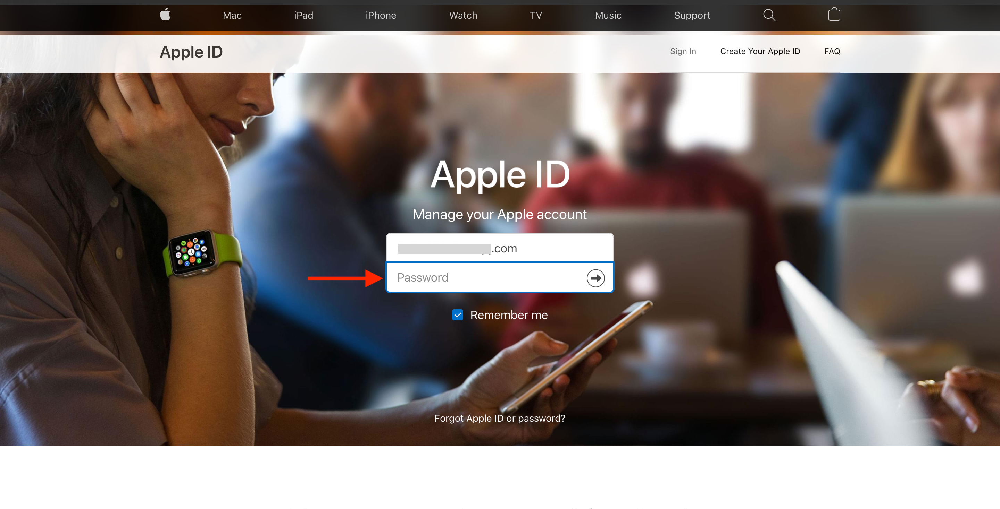
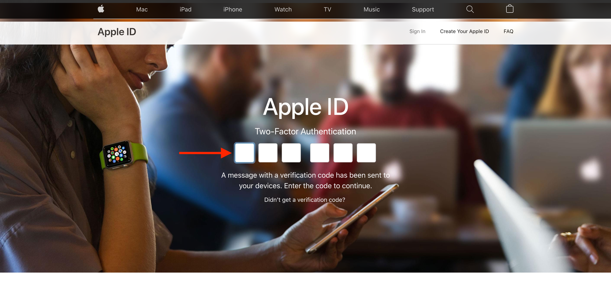
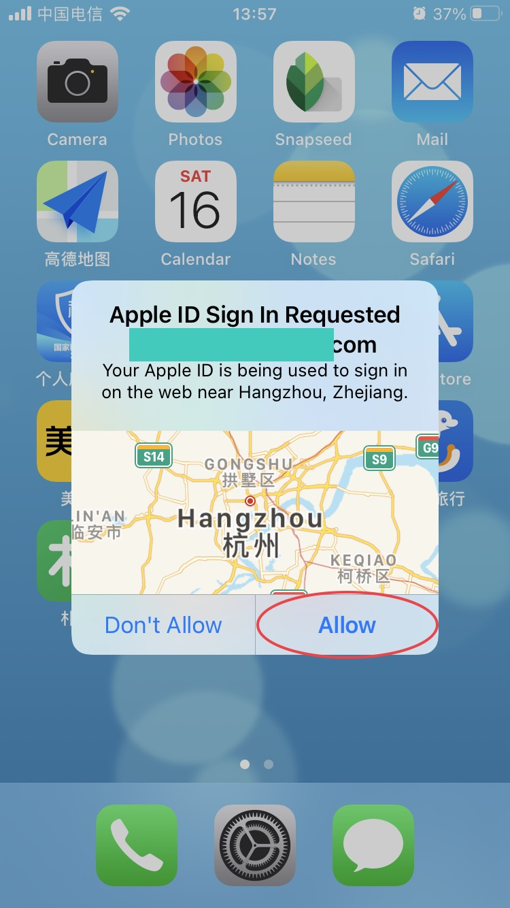
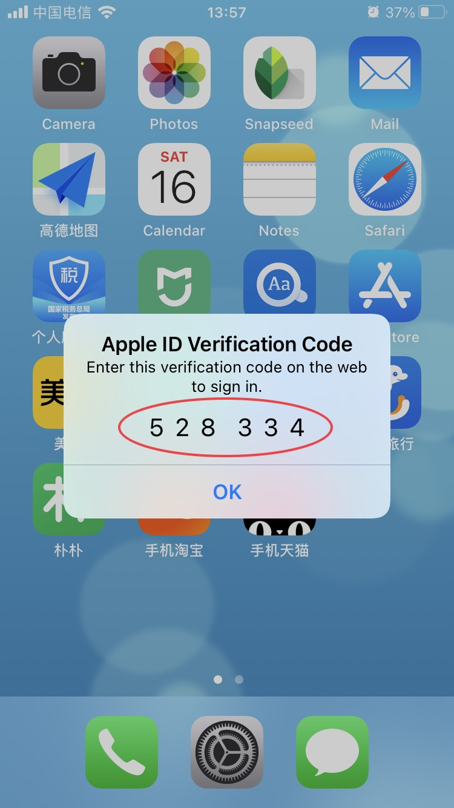
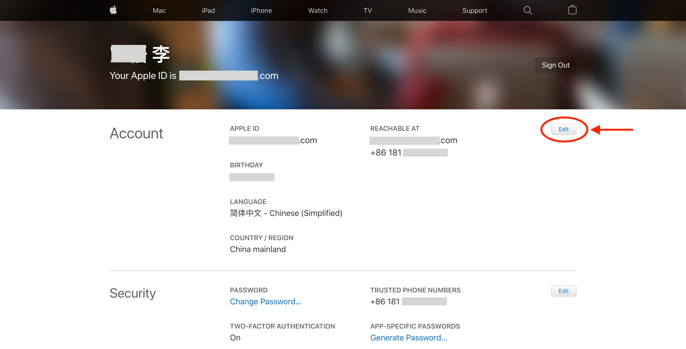
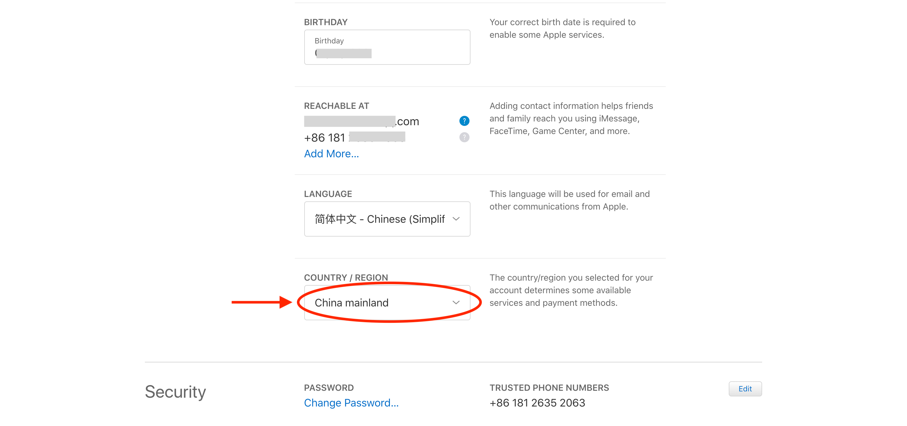
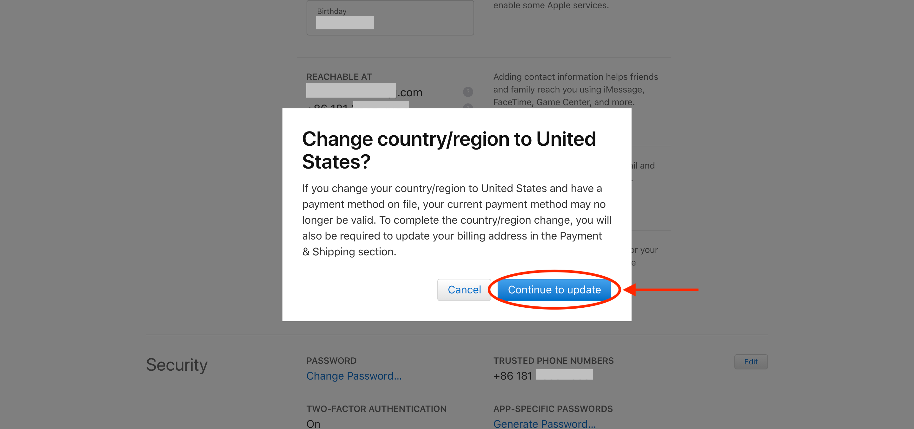
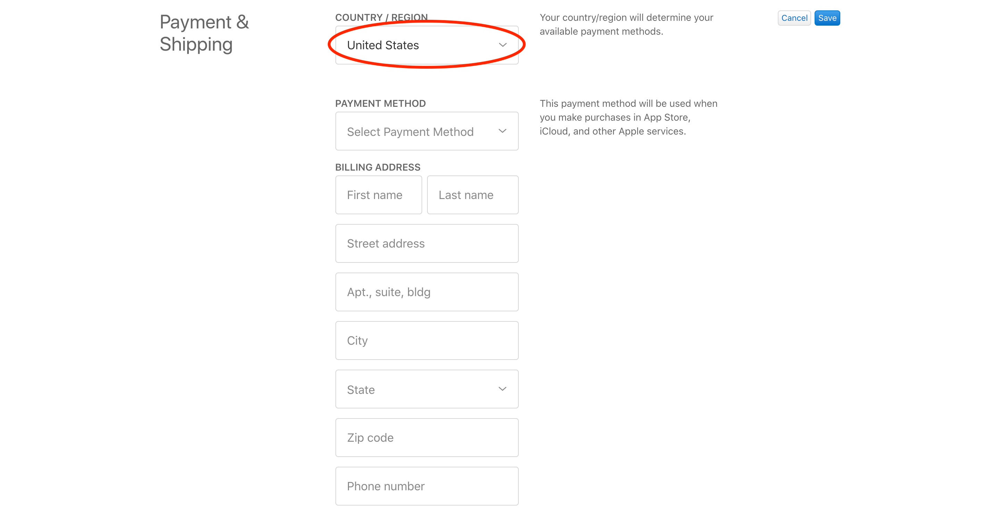
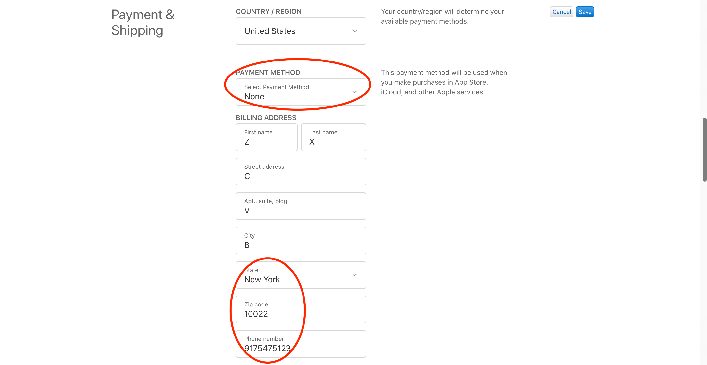

# Apple ID从中国大陆区切换为美国区

本文目录：

1. TOC
{:toc}

有时候我们需要从App Store下载某个应用，比如我要使用Oculus的客户端，但该应用在中国大陆没有上架，美国区账号却可以下载到。这时如果你有美国区的Apple ID账号当然可以直接切换使用，而如果没有另外的账号又想下载该应用，就需要切换Apple ID所属区域。

## 登陆账号

进入苹果官网账号登陆页面 https://appleid.apple.com/

如下图所示




这时会出现验证信息，这是苹果为了确保账号安全性而进行的操作。



iPhone手机端或Mac电脑端会弹出如下的对话框，确认并将弹出的验证码填入上图网页验证码位置处。




## 编辑账户信息

上述操作完成后会进入到如下的界面



点击右侧的 “Edit” 开始编辑，点击 COUNTRY/REGION 下拉菜单选择“United States”



这时会弹出是否确认改变的弹窗，点击继续



此时界面如下所示



## 输入相关信息

可以按照下图中的信息直接输入



可供参考的填写内容如下
```plain
付款方式: None

州: New York
邮编: 10022
电话: 9176212121

州: State of Montana
邮递区号: 59601
电话: 4062047893

城市: Covina
州: CA
邮递区号: 91723
电话: 6263396261

城市: Glendora
州: CA
邮递区号: 91740
电话: 9093949899
```

好了，之后再登陆iPhone App Store刷新之后即可搜索到所需App了，整个过程其实也挺简单的。

还有一点需要注意一下，无论是买的别人的美区账号，还是自己把账号改成美区，都最好只在App Store登陆，不要登陆iCloud，据说是会被别人锁设备（咱也不知道为啥，反正注意就是了）。

[1] [更改 Apple ID 国家或地区](https://support.apple.com/zh-cn/HT201389 "更改 Apple ID 国家或地区")
[2] https://zhuanlan.zhihu.com/p/347463724
[3] https://zhuanlan.zhihu.com/p/367821925
